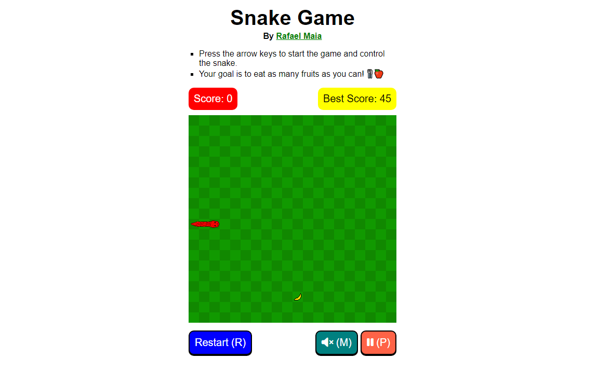

# Snake Game

It is an implementation of the classic snake game. Try to eat as much food as you can!

## Table of Contents

- [Overview](#overview)
  - [Screenshots](#screenshots)
  - [Links](#links)
- [My process](#my-process)
  - [Built with](#built-with)
  - [Thinking](#thinking)
  - [State](#state)
  - [Classes](#classes)
    - [Snake](#snake)
    - [Fruit](#fruit)
    - [View](#view)
  - [Refactoring](#refactoring)
  - [Extra](#extra)
  - [Useful resources](#useful-resources)
  - [Sound Effects](#sound-effects)
- [Author](#author)
- [License](#license)

## Overview

### Screenshots



### Links

- [Repository](https://github.com/rafaeldevvv/snake-game)
- [Live site](https://rafaeldevvv.github.io/snake-game/)

### Links

## My Process

### Built with

- HTML
- JavaScript
- Canvas API
- CSS

### Features
- Ability to play the game both in desktop and mobile devices
- Mute/Unmute button
- Pause button
- Restart button
- Sound effects
- Background song
- Score
- Animation
- Visual Assets
- Shortcuts

### Thinking

I wouldn't know how to tell you how the idea for this game came to mind, but it was really interesting and excited me a lot.

Well, I kind of stole the logic for this game from the [game project](https://eloquentjavascript.net/16_game.html) on the book called [Eloquent JavaScript](https://eloquentjavascript.net/) because that was the only time in life I had made a game. So that project helped a lot.

So I would have the classes representing the actors of the game(snake and food), the class for the state and the class to display the state.

I also used a lot of helper functions from that chapter - well, they are, in fact, very helpful.

### State

The state consists of the snake, the pieces of food over the map. the score(how many fruits have been eaten), the status(lost or playing), the boundaries(limits of the map), the best score and if the application is muted.

The object representing the state also has an `update()` method which is used to update the state. It takes the time step since the previous update and the keys currently held down.

The static `start()` method just gives you an initial state to begin the game.

```js
class State {
  constructor(snake, fruit, score, status, boundaries, bestScore, muted) {
    this.snake = snake;
    this.fruit = fruit;
    this.score = score;
    this.status = status;
    this.boundaries = boundaries;
    this.bestScore = bestScore;
    this.muted = muted;
  }

  static start(boundaries, muted) {
    const firstTail = [
      {
        position: new Vec(1, boundaries.y / 2),
        direction: "right",
      },
      {
        position: new Vec(0, boundaries.y / 2),
        direction: "right",
      },
    ];

    const firstSnake = new Snake(
      {
        position: new Vec(2, boundaries.y / 2),
        direction: "right",
      },
      firstTail,
      2,
      new Vec(snakeSpeed, 0),
      [...firstTail],
      false
    );

    return new State(
      firstSnake,
      getRandomFruit(boundaries.x, boundaries.y),
      0,
      "playing",
      boundaries,
      localStorage.getItem("best-score") || 0,
      muted
    );
  }

  update(time, keys) {
    // update snake
    const newSnake = this.snake.update(time, keys);

    // wall collision
    const snakeX = newSnake.head.position.x;
    const snakeY = newSnake.head.position.y;
    const limitX = this.boundaries.x;
    const limitY = this.boundaries.y;

    if (snakeX >= limitX || snakeY >= limitY || snakeX < 0 || snakeY < 0) {
      return new State(
        newSnake,
        this.food,
        this.score,
        "lost",
        this.boundaries
      );
    }

    // snake collision
    if (this.snake.tail.some((part) => overlap(part, newSnake.head))) {
      return new State(
        newSnake,
        this.food,
        this.score,
        "lost",
        this.boundaries
      );
    }

    // fruit collision
    let newState = this;
    for (const piece of this.food) {
      if (overlap(piece, newSnake)) {
        newState = piece.collide(newState);
      }
    }

    // return next state
    return newState;
  }
}
```

The `update()` method is also responsible for checking if the snake's head is in a valid position and if any piece of food has been collected.

The `collide()` method provided by the piece of food object updates the length of the snake.

### Classes

#### Snake

First implementation for the update function:

```js
update(time, keys) {
    // update direction based on keys
    let speed = this.speed;
    if (keys.ArrowDown && this.speed.y === 0) {
      speed = new Vec(0, snakeSpeed);
    }
    if (keys.ArrowUp && this.speed.y === 0) {
      speed = new Vec(0, -snakeSpeed);
    }
    if (keys.ArrowLeft && this.speed.x === 0) {
      speed = new Vec(-snakeSpeed, 0);
    }
    if (keys.ArrowRight && this.speed.x === 0) {
      speed = new Vec(snakeSpeed, 0);
    }

    // update head position based on direction
    let previousHeadPosition = this.lastHeadPosition;
    const newHeadPosition = this.head.position.plus(speed.times(time));

    if (
      Math.floor(newHeadPosition.x) !== Math.floor(this.head.position.x) ||
      Math.floor(newHeadPosition.y) !== Math.floor(this.head.position.y)
    ) {
      previousHeadPosition = this.head.position;
    }

    const newHead = {
      position: newHeadPosition,
    };

    // update the tail positions based on what the previous ones were
    const newTail = [{ position: previousHeadPosition }, ...this.tail];

    newTail.pop();

    // return new Snake
    return new Snake(newHead, newTail, speed, previousHeadPosition);
  }
```

The above code does not work properly because it makes the tail parts overlap each other, halting the growing of the snake.

The second implementation works as expected:

```js
class Snake {
  constructor(head, tail, tailLength, speed, previousPositions) {
    this.head = head;
    this.tail = tail; // the closer it is to the beginning of the array, the closer it is to the head
    this.speed = speed;
    this.previousPositions = previousPositions;
    this.tailLength = tailLength;
  }

  update(time, keys) {
    // update direction based on keys
    let speed = this.speed;
    if (keys.ArrowDown && this.speed.y === 0) {
      speed = new Vec(0, snakeSpeed);
    }
    if (keys.ArrowUp && this.speed.y === 0) {
      speed = new Vec(0, -snakeSpeed);
    }
    if (keys.ArrowLeft && this.speed.x === 0) {
      speed = new Vec(-snakeSpeed, 0);
    }
    if (keys.ArrowRight && this.speed.x === 0) {
      speed = new Vec(snakeSpeed, 0);
    }

    // update head position based on direction
    let previousPositions = this.previousPositions;
    const newHeadPosition = this.head.position.plus(speed.times(time));

    if (
      Math.floor(newHeadPosition.x) !== Math.floor(this.head.position.x) ||
      Math.floor(newHeadPosition.y) !== Math.floor(this.head.position.y)
    ) {
      previousPositions.unshift(this.head.position);
    }

    const newHead = {
      position: newHeadPosition,
    };

    previousPositions = previousPositions.filter((_, i) => i < this.tailLength);

    // update the tail positions based on what the previous ones were
    const newTail = this.previousPositions.map((p) => ({
      position: p,
    }));

    // return new Snake
    return new Snake(
      newHead,
      newTail,
      this.tailLength,
      speed,
      previousPositions
    );
  }

  grow() {
    const newTailLength = this.tailLength + 1;
    const newTail = this.previousPositions.map((p) => ({
      position: p,
    }));

    return new Snake(
      this.head,
      newTail,
      newTailLength,
      this.speed,
      this.previousPositions
    );
  }
}
```

I just introduced two new properties called tailLength and previousPositions. The class saves all the different positions that the head of the snake has been and gets the necessary previous positions based on the snake's length removing the unneeded ones.

The third implementation makes the snake a little bit more predictable:

```js
update(time, keys) {
    // update direction based on keys
    let speed = this.speed;
    if (keys.ArrowDown && this.speed.y === 0) {
      speed = new Vec(0, snakeSpeed);
    }
    if (keys.ArrowUp && this.speed.y === 0) {
      speed = new Vec(0, -snakeSpeed);
    }
    if (keys.ArrowLeft && this.speed.x === 0) {
      speed = new Vec(-snakeSpeed, 0);
    }
    if (keys.ArrowRight && this.speed.x === 0) {
      speed = new Vec(snakeSpeed, 0);
    }

    // update head position based on direction
    let previousPositions = this.previousPositions;
    const newHeadPosition = this.head.position.plus(speed.times(time));

    if (
      Math.floor(newHeadPosition.x) !== Math.floor(this.head.position.x) ||
      Math.floor(newHeadPosition.y) !== Math.floor(this.head.position.y)
    ) {
      previousPositions.unshift(this.head);
    }

    const newDirection = getDirection(speed);

    const newHead = {
      position: new Vec(
        newDirection === "down" || newDirection === "up"
          ? Math.floor(newHeadPosition.x)
          : newHeadPosition.x,
        newDirection === "right" || newDirection === "left"
          ? Math.floor(newHeadPosition.y)
          : newHeadPosition.y
      ),
      direction: newDirection,
    };

    previousPositions = previousPositions.filter((_, i) => i < this.tailLength);

    // update the tail positions based on what the previous ones were
    const newTail = this.previousPositions;

    // return new Snake
    return new Snake(
      newHead,
      newTail,
      this.tailLength,
      speed,
      previousPositions
    );
  }
```

Now, depending on the direction of the snake's head, I round down one axis of the snake's head's position. This makes the snake a little bit more predictable because, before when the user changed the snake's direction to one axis, the other axis would have some extra decimal numbers, making the axis be a little bit ahead of what the user would expect. Now the axis starts with no decimal numbers when it is changed, that is it starts from the position the user expects it to be.

The fourth implementation fixes an annoying bug that would make the snake's head collapse into its own tail:

I know I should avoid mutating values to make code more predictable, but only the Snake class update method would mutate the `scheduledDirectionChanges` array.

Now, a 0.5 value is added to the rounded down axis, that is because if it was only rounded down, it would go a little bit quicker if the speed was negative. This really makes the snake more predictable.

```js
update(timeStep, scheduledDirectionChanges) {
    let speed = this.speed;

    const nextDirection = scheduledDirectionChanges.shift();
    const currentAxis = getAxis(this.head.direction);
    let isChangingDirection = this.isChangingDirection;

    if (!isChangingDirection) {
      isChangingDirection = true;

      if (nextDirection === "right" && currentAxis !== "horizontal") {
        speed = new Vec(snakeSpeed, 0);
      } else if (nextDirection === "left" && currentAxis !== "horizontal") {
        speed = new Vec(-snakeSpeed, 0);
      } else if (nextDirection === "down" && currentAxis !== "vertical") {
        speed = new Vec(0, snakeSpeed);
      } else if (nextDirection === "up" && currentAxis !== "vertical") {
        speed = new Vec(0, -snakeSpeed);
      }
    } else if (nextDirection) {
      scheduledDirectionChanges.unshift(nextDirection);
    }

    const newHeadPosition = this.head.position.plus(speed.times(timeStep));

    const newHead = {
      position: new Vec(
        currentAxis === 'vertical'
          ? Math.floor(newHeadPosition.x) + 0.5
          : newHeadPosition.x,
        currentAxis === 'horizontal'
          ? Math.floor(newHeadPosition.y) + 0.5
          : newHeadPosition.y
      ),
      direction: getDirection(speed),
    };

    let previousHeads = this.previousHeads;

    if (
      ~~newHeadPosition.x !== ~~this.head.position.x ||
      ~~newHeadPosition.y !== ~~this.head.position.y
    ) {
      previousHeads.unshift(this.head);
      isChangingDirection = false;
    }

    previousHeads = previousHeads.filter((_, i) => i < this.tailLength);

    const newTail = previousHeads;

    return new Snake(
      newHead,
      newTail,
      this.tailLength,
      speed,
      previousHeads,
      isChangingDirection
    );
  }
```

I changed the approach to associate event handlers to the game. Now when the user presses some arrow key, instead of updating a property with a boolean value, the code schedules a change in the direction of the snake. It is only possible to schedule two direction changes in two different axis to avoid some problems and make the mechanism that prevents the snake from collapsing into its own tail work.

```js
const scheduledDirectionChanges = [];

window.addEventListener("keydown", (e) => {
  if (
    e.key === "ArrowDown" &&
    scheduledDirectionChanges.every((d) => getAxis(d) !== "vertical")
  ) {
    scheduledDirectionChanges.push("down");
  } else if (
    e.key === "ArrowUp" &&
    scheduledDirectionChanges.every((d) => getAxis(d) !== "vertical")
  ) {
    scheduledDirectionChanges.push("up");
  } else if (
    e.key === "ArrowLeft" &&
    scheduledDirectionChanges.every((d) => getAxis(d) !== "horizontal")
  ) {
    scheduledDirectionChanges.push("left");
  } else if (
    e.key === "ArrowRight" &&
    scheduledDirectionChanges.every((d) => getAxis(d) !== "horizontal")
  ) {
    scheduledDirectionChanges.push("right");
  }
});
```

And this is the fifth implementation that adds curve to the snake's tail. I had to change a lot of things. I think the snake's tail curves were the hardest problem to solve in this project. I know it is ugly, but I am going to refactor the entire code.

```js
update(timeStep, scheduledDirectionChanges){
  let newSpeed = this.speed;

  let currentAxis = getAxis(getDirection(newSpeed));
  let isChangingDirection = this.isChangingDirection;

  // if it is not changing direction, then we can happily steer the snake into a specific direction
  const nextDirection = scheduledDirectionChanges[0];

  if (!isChangingDirection && nextDirection) {
    isChangingDirection = true;
    scheduledDirectionChanges.shift();

    newSpeed = getSpeed(nextDirection, currentAxis, snakeSpeed) || newSpeed;
  }

  const newHeadPosition = this.head.position.plus(newSpeed.times(timeStep));

  const goingToAxis = getAxis(getDirection(newSpeed));

  // add 0.5 so that the snake won't go quicker if the newSpeed is negative
  const newHead = {
    position: new Vec(
      goingToAxis === "vertical"
        ? Math.floor(newHeadPosition.x) + 0.5
        : newHeadPosition.x,
      goingToAxis === "horizontal"
        ? Math.floor(newHeadPosition.y) + 0.5
        : newHeadPosition.y
    ),
    direction: getDirection(newSpeed),
  };

  let previousHeads = this.previousHeads;

  if (
    ~~newHeadPosition.x !== ~~this.head.position.x ||
    ~~newHeadPosition.y !== ~~this.head.position.y
  ) {
    // it only adds positions that are different in either axis to avoid overlapping
    const currentHead = { ...this.head };

    const lastDirection = this.tail[0]?.direction || this.head.direction;
    const nextAxis = getAxis(newHead.direction);
    const currentAxis = getAxis(lastDirection);

    // if any axis position is different from what it was before, then the direction changed successfully
    if (currentAxis !== nextAxis) {
      currentHead.isCurve = true;
      currentHead.directions = [
        getOppositeDirection(lastDirection),
        newHead.direction,
      ];
    }

    previousHeads.unshift(currentHead);
    isChangingDirection = false;
  }

  // it cuts off the unnecessary saved positions based on the current tail length;
  previousHeads = previousHeads.filter((_, i) => i < this.tailLength);

  const newTail = [...previousHeads];

  return new Snake(
    newHead,
    newTail,
    this.tailLength,
    newSpeed,
    previousHeads,
    isChangingDirection
  );
}
```

#### Fruit

The `Fruit` class has a `collide()` method which is called when the snake's head overlaps the food. It returns a new state without the piece of food that was eaten and with the longer snake and it also adds one to the score:

```js
class Fruit {
  constructor(x, y, color) {
    this.position = { x, y };
    this.color = color;
  }

  collide(state) {
    const snake = state.snake;
    const longerSnake = snake.grow();
    eatingSoundEffect.currentTime = 0;
    eatingSoundEffect.play();

    return new State(
      longerSnake,
      state.food.filter((f) => f !== this),
      state.score + (this.score || 1),
      state.status,
      state.boundaries
    );
  }
}
```

The second implementation introduces an oscillation to the fruit to make it stand out a little bit more:

```js
class Fruit {
  constructor(position, tileX, osc, oscDirection) {
    this.position = position;
    this.tileX = tileX;

    // oscillation
    this.osc = osc;
    this.oscDirection = oscDirection;
  }

  update(timeStep) {
    let osc = this.osc;

    if (this.oscDirection === "positive") {
      osc += timeStep * maxFruitOsc;
    } else {
      osc -= timeStep * maxFruitOsc;
    }

    let oscDirection = this.oscDirection;
    if (osc > maxFruitOsc) {
      oscDirection = "negative";
    } else if (osc < 0) {
      oscDirection = "positive";
    }

    return new Fruit(this.position, this.tileX, osc, oscDirection);
  }
}
```

I also had to make some changes to the way the fruit was drawn with the oscillation:

```js
drawFruit(fruit) {
  const { x, y } = fruit.position;

  const scaledOsc = fruit.osc * scale;

  this.canvasContext.drawImage(
    fruitsSprite,
    scale * fruit.tileX,
    0,
    scale,
    scale,
    Math.floor(x) * scale - scaledOsc / 2,
    Math.floor(y) * scale - scaledOsc / 2,
    scale + scaledOsc,
    scale + scaledOsc
  );
}
```

I have to subtract half the scaled oscillation to make it stay in the center of the square and sum the normal scale with the scaled oscillation when passing the size of the fruit to the `drawImage()` method.

#### View

I used the canvas api to render this game because I planned to give the snake a pixel-art style skin and I would also make the fruits in pixel-art style.

This class has a `syncState()` method that gets a given state and renders it.

```js
class CanvasDisplay {
  constructor(width, height) {
    this.dom = elt("canvas", {
      width: width * scale,
      height: height * scale,
    });

    this.width = width;
    this.height = height;
  }

  syncState(state) {
    // draw snake
    // draw food
    // show score
  }
}
```

The `runGame()` function actually runs the game by assembling all the high-level components and using a function to run the animation.

```js
function runGame() {
  let state = State.start(mapBoundaries);
  const display = new CanvasDisplay(mapBoundaries.x, mapBoundaries.y);
  document.body.appendChild(display.dom);

  // it is used to schedule changes in the snake's direction
  const scheduledDirectionChanges = [];

  window.addEventListener("keydown", (e) => {
    if (
      e.key === "ArrowDown" &&
      scheduledDirectionChanges.every((d) => getAxis(d) !== "vertical")
    ) {
      scheduledDirectionChanges.push("down");
    } else if (
      e.key === "ArrowUp" &&
      scheduledDirectionChanges.every((d) => getAxis(d) !== "vertical")
    ) {
      scheduledDirectionChanges.push("up");
    } else if (
      e.key === "ArrowLeft" &&
      scheduledDirectionChanges.every((d) => getAxis(d) !== "horizontal")
    ) {
      scheduledDirectionChanges.push("left");
    } else if (
      e.key === "ArrowRight" &&
      scheduledDirectionChanges.every((d) => getAxis(d) !== "horizontal")
    ) {
      scheduledDirectionChanges.push("right");
    }
  });

  runAnimation((timeStep) => {
    state = state.update(timeStep, scheduledDirectionChanges);

    if (state.status === "playing") {
      display.syncState(state);
      return true;
    } else {
      console.log("lost");
      return false;
    }
  });
}
```

I am quite proud of this function. I didn't know it was so simple. It simply required a `x + y` expression to work as I wanted. Well, I found this solution almost by accident. I knew there was something to do with addition so I was testing and it worked.

```js
function drawChessBackground(context, width, height, color1, color2) {
  for (let y = 0; y < height; y++) {
    for (let x = 0; x < width; x++) {
      context.fillStyle = (x + y) % 2 === 0 ? color1 : color2;
      context.fillRect(x * scale, y * scale, scale, scale);
    }
  }
}
```

The second implementation becomes a lot more complex due to addition of new features:

```js
class View {
  constructor(canvasWidth, canvasHeight, onRestart, onMute) {}

  set score(newScore) {}

  set bestScore(newBestScore) {}

  syncState(state) {}

  endGame() {}

  set muted(muted) {}

  clear() {}

  drawBackground() {}

  drawFruit(fruit) {}

  drawSnakeHead(snake) {}

  drawSnakeTail(tail) {}
}
```

### Refactoring

I replaced the `runGame()` function with the Controller class because it grew enough to deserve its own class:

```js
function runGame() {
  // start game
  // associate event handlers
  // run game
}

class Controller {
  init(state, view) {
    // start everything
  }

  // some methods to handle events, run the game, schedule direction changes and more
}
```

See the source code to see the classes because they're quite huge to put here.

I improved the readability of the constructor function of the View class. Now you can guess what is done without reading the methods themselves.

Before:

```js
class View {
  constructor(controller, state) {
    this.controller = controller;
    this.state = state;

    this.scoreDOM = $("#current-score");
    this.bestScoreDOM = $("#best-score");
    this.muteButton = $("#mute-btn");
    this.pauseBtn = $("#pause-btn");

    const canvas = elt("canvas", {
      width: this.canvasWidth * scale,
      height: this.canvasHeight * scale,
    });

    this.canvasContext = canvas.getContext("2d");

    this.finalMessageContainer = elt("div");

    this.canvasContainer = elt(
      "div",
      { className: "canvas-container" },
      canvas,
      this.finalMessageContainer
    );

    $("#canvas-container").appendChild(this.canvasContainer);

    const shortcuts = [
      { key: "p", func: () => controller.handlePauseGame() },
      { key: "m", func: () => controller.handleMuteGame() },
      { key: "r", func: () => controller.restartGame() },
    ];

    window.addEventListener("keydown", (e) => {
      if (e.key.indexOf("Arrow") !== -1) {
        e.preventDefault();
        this.controller.handleArrowPress(e);
      }

      const index = shortcuts.findIndex((s) => s.key === e.key);
      if (index !== -1) {
        e.preventDefault();
        shortcuts[index].func();
      }
    });

    $("#restart-btn").onclick = () => this.controller.restartGame();
    this.muteButton.onclick = () => this.controller.handleMuteGame();
    this.pauseBtn.onclick = () => controller.handlePauseGame();

    $$("#mobile-controller button").forEach((b) => {
      b.onclick = function (e) {
        controller.handleArrowPress({
          key: this.getAttribute("data-direction"),
        });
      };
    });

    this.drawBackground();

    if (snakeSprite.complete) {
      this.snake = state.snake;
    } else {
      snakeSprite.onload = () => (this.snake = state.snake);
    }

    if (fruitsSprite.complete) {
      this.fruit = state.fruit;
    } else {
      fruitsSprite.onload = () => (this.fruit = state.fruit);
    }

    this.muted = state.muted;
    this.paused = this.controller.isGamePaused;
    this.bestScore = state.bestScore;
    this.score = state.score;
  }
}
```

After:

```js
class View {
  constructor(controller, state, shortcuts) {
    this.controller = controller;
    this.state = state;
    this.shortcuts = shortcuts;

    this.canvasWidth = state.boundaries.x;
    this.canvasHeight = state.boundaries.y;

    this.createCanvas();
    this.getReferences();
    this.registerEventHandlers();
    this.init(state);
  }
}
```

### Extra

I just discovered this shorthand to round a number down:

```js
if (
  ~~newHeadPosition.x !== ~~this.head.position.x ||
  ~~newHeadPosition.y !== ~~this.head.position.y
) {
  // it only adds positions that are different in either axis to avoid overlapping
  previousHeads.unshift(this.head);

  // if any axis position is different from what it was before, then the direction changed successfully
  isChangingDirection = false;
}
```

I put some extra metadata that I just learned about in the HTML head:

```html
<meta charset="utf-8" />
<meta name="viewport" content="width=device-width, initial-scale=1.0" />
<meta http-equiv="X-UA-Compatible" content="ie=edge" />
<meta name="author" content="Rafael Maia" />
<meta
  name="description"
  content="This is an implementation of the classic Snake Game"
/>

<!-- Open Graph -->
<meta property="og:title" content="Snake Game" />
<meta property="og:image" content="./screenshot.png" />
<meta
  property="og:description"
  content="This is an implementation of the classic Snake Game"
/>
<meta property="og:type" content="website" />
<meta property="og:url" content="https://rafaeldevvv.github.io/snake-game/" />

<!-- Twitter -->
<meta name="twitter:image" content="./screenshot.png" />
<meta name="twitter:title" content="Snake Game" />
<meta
  name="twitter:description"
  content="This is an implementation of the classic Snake Game"
/>
<meta name="twitter:creator" content="rafaeldevvv" />
<title>Snake Game</title>
```

### Useful Resources

- [chatGPT](https://chat.openai.com/) - I used it for almost every doubt
- [Eloquent JS](https://eloquentjavascript.net/) - Game Project Reference
- [Epidemic Sound](https://www.epidemicsound.com/) - I used it to get the sound effect.
- [Free SVG](https://freesvg.org/) - I got some reference images from here.
- [pixilart](https://www.pixilart.com/) - I used it to draw the fruits and the snake. I first tried to draw the fruits with PhotoShop, but my computer couldn't keep VS Code and PhotoShop open at the same time.

### Sound Effects

- [Eating Sound Effect](https://www.epidemicsound.com/track/ndQZD8ofQt/)
- [Background](https://opengameart.org/content/platformer-game-music-pack)

## Author

- Twitter => [@rafaeldevvv](https://www.twitter.com/rafaeldevvv)
- Instagram => [@rafaeldevvv](https://www.instagram.com/rafaeldevvv)
- YouTube => [@rafaelmaia4836](https://www.youtube.com/channel/UC_QOvDZdUskTSJ59eMDjuEg)
- GitHub => [@rafaeldevvv](https://github.com/rafaeldevvv)

## License

MIT License

Copyright (c) 2023 Rafael Maia

Permission is hereby granted, free of charge, to any person obtaining a copy
of this software and associated documentation files (the "Software"), to deal
in the Software without restriction, including without limitation the rights
to use, copy, modify, merge, publish, distribute, sublicense, and/or sell
copies of the Software, and to permit persons to whom the Software is
furnished to do so, subject to the following conditions:

The above copyright notice and this permission notice shall be included in all
copies or substantial portions of the Software.

THE SOFTWARE IS PROVIDED "AS IS", WITHOUT WARRANTY OF ANY KIND, EXPRESS OR
IMPLIED, INCLUDING BUT NOT LIMITED TO THE WARRANTIES OF MERCHANTABILITY,
FITNESS FOR A PARTICULAR PURPOSE AND NONINFRINGEMENT. IN NO EVENT SHALL THE
AUTHORS OR COPYRIGHT HOLDERS BE LIABLE FOR ANY CLAIM, DAMAGES OR OTHER
LIABILITY, WHETHER IN AN ACTION OF CONTRACT, TORT OR OTHERWISE, ARISING FROM,
OUT OF OR IN CONNECTION WITH THE SOFTWARE OR THE USE OR OTHER DEALINGS IN THE
SOFTWARE.

## scratch

````js
function runGame() {
  let state = State.start(mapBoundaries, true);
  const view = new View(
    mapBoundaries.x,
    mapBoundaries.y,
    () => {
      state = State.start(mapBoundaries, state.muted);
      scheduledDirectionChanges = [];
      paused = false;
      running = false;
      view.clearFinalMessage();
      view.syncState(state);
      cancelAnimationFrame(currentAnimation);
    },
    () => {
      state.muted = !state.muted;

      if (!state.muted) {
        backgroundSong.play();
      } else {
        backgroundSong.pause();
      }

      view.muted = state.muted;
    }
  );
  view.syncState(state);

  snakeSprite.onload = function () {
    if (fruitsSprite.complete) {
      view.syncState(state);
    } else {
      fruitsSprite.onload = function () {
        view.syncState(state);
      };
    }
  };

  // it is used to schedule changes in the snake's direction
  let scheduledDirectionChanges = [];

  let paused = false;
  // we use this variable to start the game with the arrow keys
  let running = false;

  window.addEventListener("keydown", (e) => {
    // to prevent scrolling
    if (e.key.indexOf("Arrow") !== -1) {
      e.preventDefault();
    }

    // to start the game
    if (!running && e.key.indexOf("Arrow") !== -1) {
      running = true;
      runAnimation(runner);
    }

    // to pause
    if (e.key === "Escape") {
      paused = !paused;
    }

    if (paused) return;

    if (
      e.key === "ArrowDown" &&
      scheduledDirectionChanges.every((d) => getAxis(d) !== "vertical")
    ) {
      scheduledDirectionChanges.push("down");
    } else if (
      e.key === "ArrowUp" &&
      scheduledDirectionChanges.every((d) => getAxis(d) !== "vertical")
    ) {
      scheduledDirectionChanges.push("up");
    } else if (
      e.key === "ArrowLeft" &&
      scheduledDirectionChanges.every((d) => getAxis(d) !== "horizontal")
    ) {
      scheduledDirectionChanges.push("left");
    } else if (
      e.key === "ArrowRight" &&
      scheduledDirectionChanges.every((d) => getAxis(d) !== "horizontal")
    ) {
      scheduledDirectionChanges.push("right");
    }
  });

  // this function might be called a lot of times, so instead of defining it on the spot, I just defined it here
  function runner(timeStep) {
    if (paused) return true;

    state = state.update(timeStep, scheduledDirectionChanges);

    if (state.status === "playing") {
      view.syncState(state);
      return true;
    } else {
      view.endGame(state);
      if (state.score > Number(localStorage.getItem("best-score"))) {
        localStorage.setItem("best-score", state.score);
        state.bestScore = state.score;
      }
      return false;
    }
  }
}
// runGame();```
````
